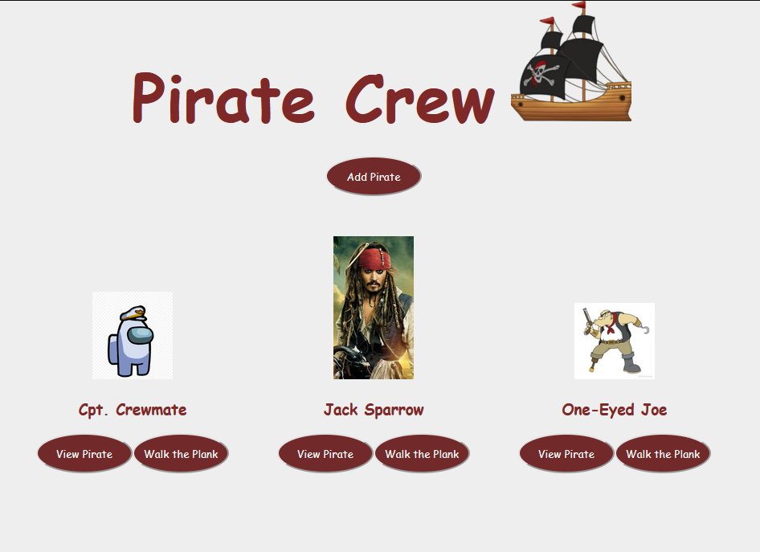
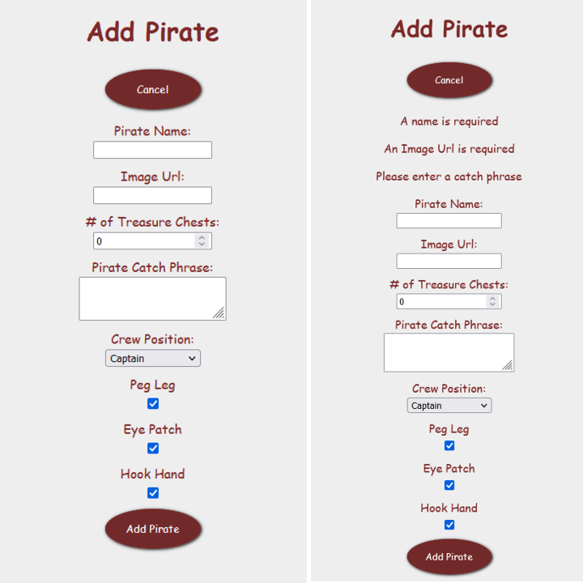
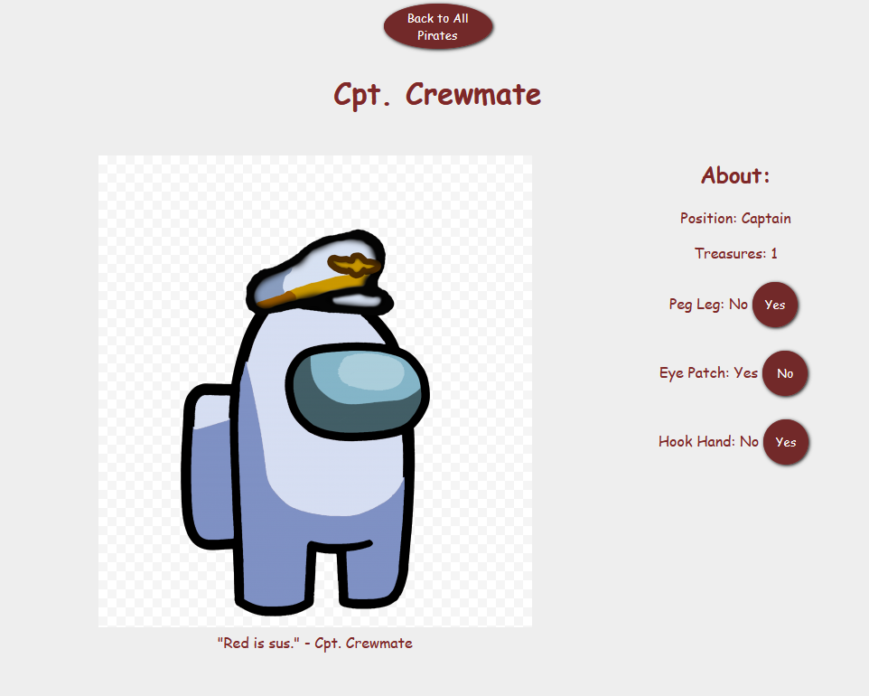
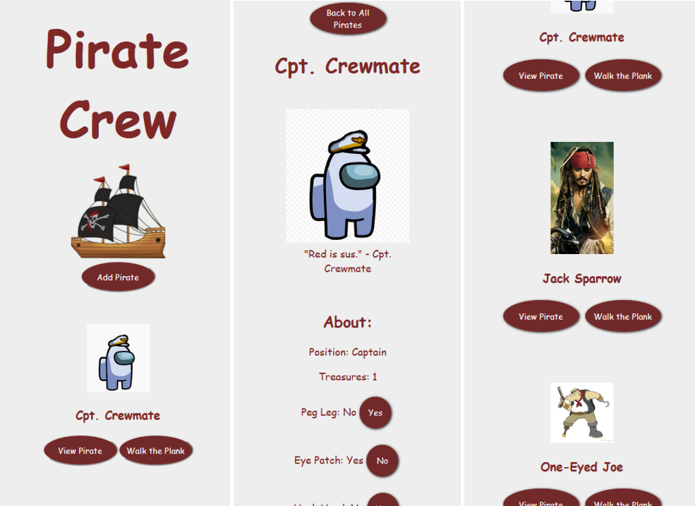

[](https://open.vscode.dev/KimGreenbush/Pirate_Crew)

# Pirate_Crew

A fun app to create the perfect pirate crew.

Give each crew mate a name, postion, quote, and decide if they should have a peg leg, hook, and/or eye patch!

The About page of each pirate shows their details and lets you "change" their looks by switching their eye patch, peg leg, or hook stats.

If you need to remove a pirate have them Walk the Plank! They're organized alphabetically so it's easy to find whom you're looking for.

And it's responsive so you can build your crew easily on any screen!


## Visuals

Check out the [images](images) folder for more images.






## Prerequisites

You will need a package manager to run the installation. I used [npm](https://docs.npmjs.com/downloading-and-installing-node-js-and-npm) which comes with Node.js. And [Git](https://git-scm.com/book/en/v2/Getting-Started-Installing-Git) for cloning.

## Installation

Using a terminal:

```shell
    // clone the repository
    git clone https://github.com/KimGreenbush/WttA__Welcome-to-the-Arcade.git

    // install dependencies
    npm install

    // navigate to the client folder and install dependencies
    cd client
    npm install
```

### Running the app

The client and server run independently from each other so you'll need to run servers in different terminals.

```shell
    // terminal 1, start the express app where server.js is
    npm run start
```

```shell
    // terminal 2, start the client app
    cd client
    npm run start
```

## Running the tests

There some snapshot tests for the client side that make sure the components render and track their changes.

```shell
    // navigate to the client side to run its tests
    cd client
    npm run test
```

## License

This project is licensed under the [GNU General Public License v3.0](license.md)
Free Software Foundation, Inc. - see the [license.md](license.md) file for
details